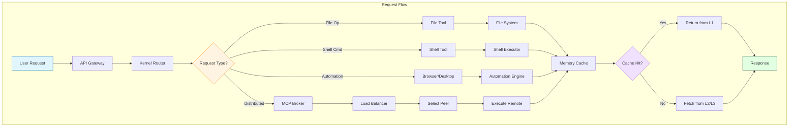
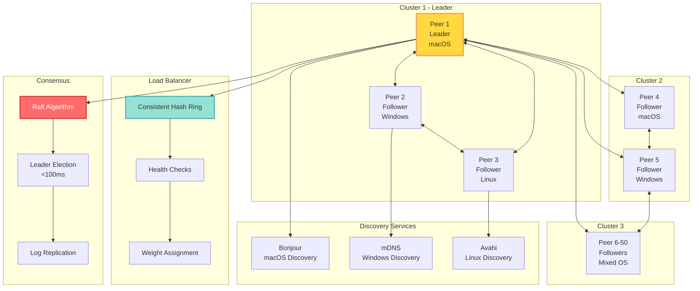
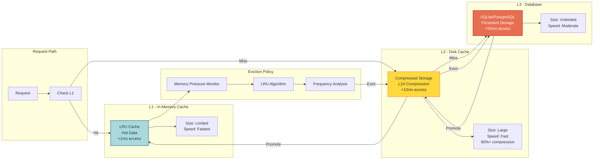
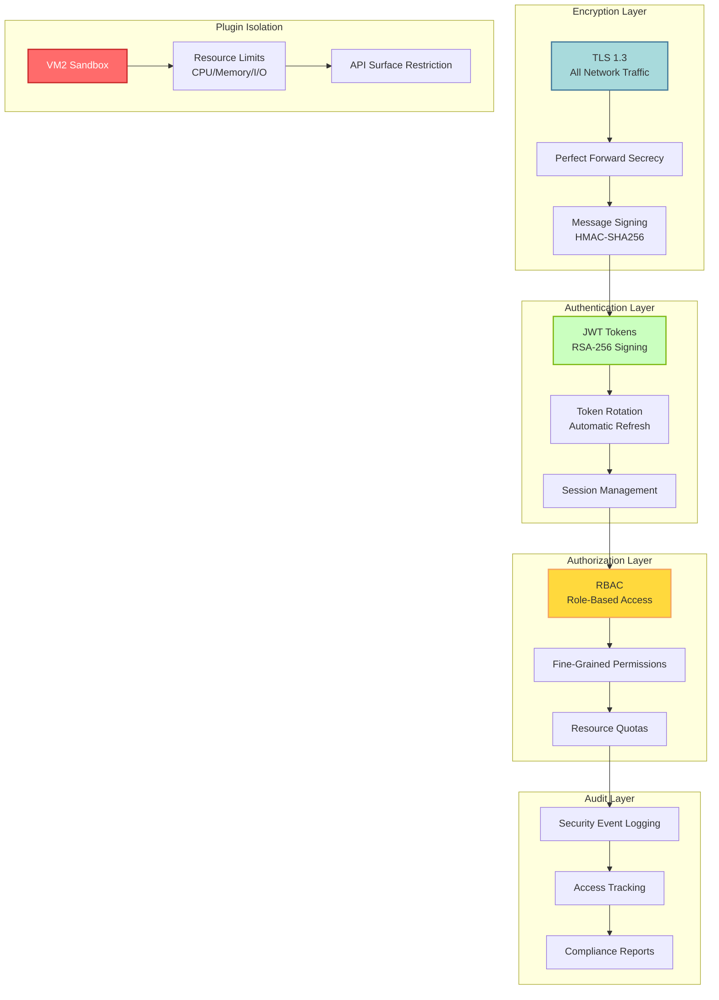
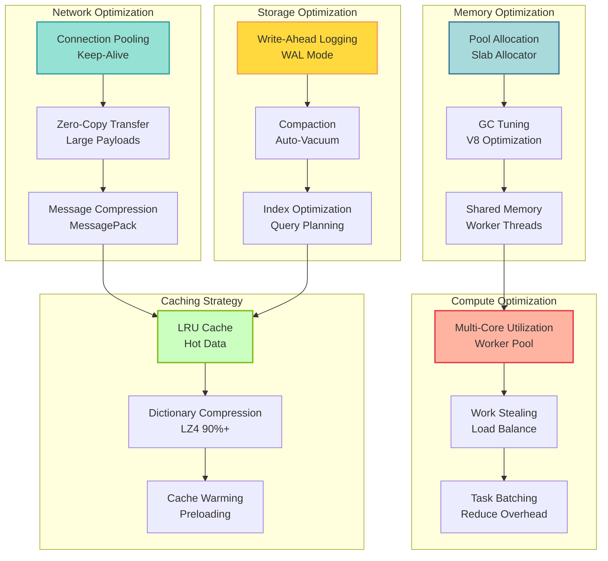
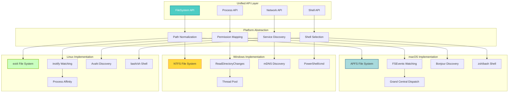

# Operone - System Architecture Diagram

**Comprehensive System Architecture Overview**  
**Generated:** December 11, 2025  
**Version:** 0.2.0  
**Based on:** PROJECT_PROPOSAL.md

---

## 🏗️ Complete System Architecture

```mermaid
graph TB
    subgraph "User Applications Layer"
        UA[User Applications]
        CLI[CLI Interface]
        WEB[Web Dashboard]
        API[REST API]
    end
    
    subgraph "Kernel Layer - @repo/operone"
        KERNEL[Operone Kernel<br/>Orchestration Engine]
        GATEWAY[Unified API Gateway]
        DISCOVERY[Service Discovery]
        HEALTH[Health Monitor]
    end
    
    subgraph "Core OS Services - @operone/core"
        SCHED[Task Scheduler<br/>Priority Queue]
        PROC[Process Manager<br/>Lifecycle Control]
        RES[Resource Allocator<br/>CPU/Memory]
        IPC[Event System<br/>Inter-Process Comm]
    end
    
    subgraph "Distributed Networking - @operone/networking"
        P2P[P2P Mesh Network<br/>50+ Peers]
        DISC[Auto Discovery<br/>Bonjour/mDNS/Avahi]
        LB[Load Balancer<br/>Consistent Hashing]
        SSH[SSH Client<br/>Secure Remote]
        WS[WebSocket Server<br/>TLS 1.3]
        RAFT[Raft Consensus<br/>Leader Election]
    end
    
    subgraph "Tool Execution - @operone/mcp"
        BROKER[MCP Broker<br/>Distributed Tools]
        FTOOL[File Tool<br/>FS Operations]
        STOOL[Shell Tool<br/>Command Exec]
        LTOOL[Log Tool<br/>Structured Logs]
    end
    
    subgraph "File System - @operone/fs"
        FS[FileSystem API<br/>Unified Interface]
        WATCH[File Watcher<br/>Real-time Events]
        PARSE[Document Parser<br/>PDF/DOCX/TXT]
        PATH[Path Utils<br/>Cross-Platform]
    end
    
    subgraph "Command Execution - @operone/shell"
        SHELL[Shell Executor<br/>Secure Execution]
        STREAM[Stream Handler<br/>stdin/stdout/stderr]
        ENV[Environment Manager<br/>Variables]
    end
    
    subgraph "Memory Management - @operone/memory"
        L1[L1 Cache<br/>In-Memory LRU]
        L2[L2 Cache<br/>Compressed Disk<br/>LZ4 90%+ ratio]
        L3[L3 Storage<br/>Database Persist]
        EVICT[Eviction Policy<br/>Memory Pressure]
    end
    
    subgraph "Database - @operone/db"
        SQLITE[SQLite<br/>Local Storage]
        POSTGRES[PostgreSQL<br/>Distributed]
        KYSELY[Kysely<br/>Type-Safe Queries]
        MIGRATE[Migration System<br/>Schema Evolution]
    end
    
    subgraph "Automation - @operone/automation"
        BROWSER[Browser Control<br/>Playwright/Puppeteer]
        DESKTOP[Desktop Automation<br/>RobotJS]
        SCREEN[Screenshot/Video<br/>Recording]
        IMAGE[Image Processing<br/>Jimp]
    end
    
    subgraph "Parallel Execution - @operone/fastlane"
        POOL[Worker Pool<br/>Piscina]
        QUEUE[Task Queue<br/>Priority Support]
        STEAL[Work Stealing<br/>Load Balance]
    end
    
    subgraph "Plugin System - @operone/plugins"
        SANDBOX[VM2 Sandbox<br/>Isolation]
        LIFECYCLE[Plugin Lifecycle<br/>Install/Load/Unload]
        PERMS[Permission System<br/>Fine-Grained]
    end
    
    subgraph "Storage Layer"
        DBFILE[(SQLite DB<br/>better-sqlite3)]
        PGDB[(PostgreSQL<br/>Distributed)]
        CACHE[(Disk Cache<br/>LZ4 Compressed)]
    end
    
    subgraph "External Services"
        BONJOUR[Bonjour<br/>macOS]
        MDNS[mDNS<br/>Windows]
        AVAHI[Avahi<br/>Linux]
    end
    
    subgraph "Platform Layer"
        MACOS[macOS 11+<br/>APFS/FSEvents]
        WINDOWS[Windows 10+<br/>NTFS/ReadDirChanges]
        LINUX[Linux 4.x+<br/>ext4/inotify]
    end
    
    %% User Layer Connections
    UA --> GATEWAY
    CLI --> GATEWAY
    WEB --> GATEWAY
    API --> GATEWAY
    
    %% Kernel Connections
    GATEWAY --> KERNEL
    KERNEL --> DISCOVERY
    KERNEL --> HEALTH
    KERNEL --> SCHED
    
    %% Core Services
    SCHED --> PROC
    PROC --> RES
    RES --> IPC
    
    %% Networking
    KERNEL --> P2P
    P2P --> DISC
    P2P --> LB
    P2P --> WS
    P2P --> RAFT
    DISC --> SSH
    
    %% MCP Tools
    KERNEL --> BROKER
    BROKER --> FTOOL
    BROKER --> STOOL
    BROKER --> LTOOL
    FTOOL --> FS
    STOOL --> SHELL
    
    %% File System
    FS --> WATCH
    FS --> PARSE
    FS --> PATH
    
    %% Shell
    SHELL --> STREAM
    SHELL --> ENV
    
    %% Memory Tiers
    KERNEL --> L1
    L1 --> L2
    L2 --> L3
    L1 --> EVICT
    L3 --> SQLITE
    
    %% Database
    SQLITE --> KYSELY
    POSTGRES --> KYSELY
    KYSELY --> MIGRATE
    KYSELY --> DBFILE
    KYSELY --> PGDB
    
    %% Automation
    KERNEL --> BROWSER
    BROWSER --> DESKTOP
    DESKTOP --> SCREEN
    SCREEN --> IMAGE
    
    %% Parallel Execution
    KERNEL --> POOL
    POOL --> QUEUE
    QUEUE --> STEAL
    
    %% Plugins
    KERNEL --> SANDBOX
    SANDBOX --> LIFECYCLE
    LIFECYCLE --> PERMS
    
    %% Storage
    L2 --> CACHE
    L3 --> DBFILE
    
    %% Platform Discovery
    DISC --> BONJOUR
    DISC --> MDNS
    DISC --> AVAHI
    
    %% Platform Support
    FS --> MACOS
    FS --> WINDOWS
    FS --> LINUX
    
    %% Styling
    style KERNEL fill:#ff6b6b,stroke:#c92a2a,stroke-width:3px,color:#fff
    style GATEWAY fill:#4ecdc4,stroke:#0a9396,stroke-width:2px,color:#fff
    style P2P fill:#95e1d3,stroke:#38a3a5,stroke-width:2px
    style BROKER fill:#ffd93d,stroke:#f4a261,stroke-width:2px
    style L1 fill:#a8dadc,stroke:#457b9d,stroke-width:2px
    style SQLITE fill:#e76f51,stroke:#d62828,stroke-width:2px,color:#fff
    style BROWSER fill:#b8b8ff,stroke:#6a4c93,stroke-width:2px
    style POOL fill:#ffb4a2,stroke:#e63946,stroke-width:2px
    style SANDBOX fill:#caffbf,stroke:#80b918,stroke-width:2px
```



---

## 🔄 Data Flow Architecture



---

## 🌐 Distributed Network Topology



---

## 💾 Memory Hierarchy



---

## 🔐 Security Architecture



---

## 🚀 Performance Optimization Stack



---

## 📦 Package Dependency Graph

```mermaid
graph TB
    subgraph "Application Layer"
        APP[User Applications]
    end
    
    subgraph "Kernel"
        KERN[@repo/operone<br/>Main Kernel]
    end
    
    subgraph "Core Packages"
        CORE[@operone/core<br/>Task Orchestration]
        MCP[@operone/mcp<br/>Tool Drivers]
        NET[@operone/networking<br/>P2P Network]
        FS[@operone/fs<br/>File System]
        SHELL[@operone/shell<br/>Command Exec]
        MEM[@operone/memory<br/>Memory Mgmt]
        DB[@operone/db<br/>Database]
        AUTO[@operone/automation<br/>Browser/Desktop]
        FAST[@operone/fastlane<br/>Parallel Exec]
        PLUG[@operone/plugins<br/>Plugin System]
    end
    
    subgraph "Shared"
        SHARED[@operone/shared<br/>Utilities]
        TYPES[@repo/types<br/>Type Definitions]
        ESLINT[@repo/eslint-config]
        TSCONF[@repo/typescript-config]
    end
    
    APP --> KERN
    
    KERN --> CORE
    KERN --> MCP
    KERN --> NET
    KERN --> MEM
    
    MCP --> NET
    MCP --> FS
    MCP --> SHELL
    
    FS --> SHARED
    SHELL --> SHARED
    
    MEM --> DB
    
    CORE --> TYPES
    MCP --> TYPES
    NET --> TYPES
    FS --> TYPES
    SHELL --> TYPES
    MEM --> TYPES
    DB --> TYPES
    AUTO --> TYPES
    FAST --> TYPES
    PLUG --> TYPES
    SHARED --> TYPES
    
    KERN --> ESLINT
    KERN --> TSCONF
    
    style KERN fill:#ff6b6b,stroke:#c92a2a,stroke-width:3px,color:#fff
    style TYPES fill:#4ecdc4,stroke:#0a9396,stroke-width:2px,color:#fff
```

---

## 🎯 Cross-Platform Abstraction



---

## 📊 Performance Metrics

| Component | Latency | Throughput | Scalability |
|-----------|---------|------------|-------------|
| **File Operations** | <10ms (local) | 10,000+ ops/sec | Linear |
| **Network Messages** | <100ms (remote) | 1,000+ msg/sec/peer | 50+ peers |
| **Database Queries** | <10ms (indexed) | 10,000+ inserts/sec | Horizontal |
| **Leader Election** | <100ms | N/A | 50+ peers |
| **Load Distribution** | <1s rebalance | Even ±5% | Consistent hash |
| **Memory Cache (L1)** | <1ms | Sub-millisecond | LRU eviction |
| **Memory Cache (L2)** | <10ms | 90%+ compression | Disk-based |
| **Task Execution** | Variable | 1,000+ tasks/sec | Multi-core |

---

## 🔗 Key Technologies

| Layer | Technology | Purpose |
|-------|-----------|---------|
| **Runtime** | Node.js + TypeScript | Cross-platform execution |
| **Database** | SQLite 12.5.0 | Local persistence |
| **Database** | PostgreSQL | Distributed storage |
| **Query Builder** | Kysely 0.27.6 | Type-safe SQL |
| **Networking** | Socket.IO 4.8.1 | WebSocket communication |
| **Discovery** | Bonjour 3.5.0 | Service discovery |
| **SSH** | ssh2 1.17.0 | Secure remote execution |
| **Caching** | lru-cache 10.4.3 | LRU implementation |
| **Compression** | lz4 0.6.5 | Fast compression |
| **File Watching** | chokidar 3.6.0 | Cross-platform watching |
| **Shell Execution** | execa 8.0.1 | Process execution |
| **Browser Automation** | Playwright 1.57.0 | Multi-browser support |
| **Worker Pool** | Piscina 4.9.2 | Thread pool management |
| **Sandboxing** | VM2 3.10.0 | Plugin isolation |

---

## 🎯 Design Principles

1. **Micro-Kernel Architecture**: Minimal core with modular packages
2. **Platform Abstraction**: Single API across macOS, Windows, Linux
3. **Distributed-First**: Built for 50+ peer networks
4. **Type Safety**: Full TypeScript with strict checking
5. **Performance**: Sub-100ms latency for critical operations
6. **Security**: TLS 1.3, JWT, RBAC, sandboxing
7. **Fault Tolerance**: Automatic failover and recovery
8. **Observability**: Comprehensive event system and monitoring

---

## 📈 Scalability Characteristics

- **Horizontal Scaling**: Add peers dynamically (tested 50+)
- **Vertical Scaling**: Multi-core utilization via worker pools
- **Load Distribution**: Consistent hashing with <5% variance
- **Fault Tolerance**: Handles (N-1)/2 node failures
- **Auto-Discovery**: Zero-configuration peer joining
- **Leader Election**: <100ms consensus with Raft
- **Memory Efficiency**: 60%+ reduction via tiered caching
- **Network Efficiency**: 40%+ improvement with zero-copy

---

*This architecture diagram provides a comprehensive view of the Operone distributed operating system, showing all major components, their interactions, and the underlying technologies that power the platform.*
