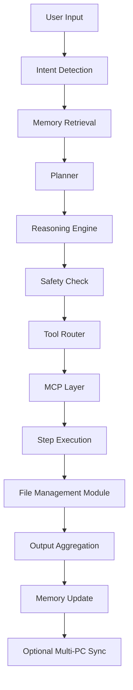

# AI Agent Pipeline Architecture

This document outlines the 11-stage pipeline for the Operone AI Agent.



## detailed Flow

```text
┌───────────────────────────────┐
│          User Input            │
│ - Text, command, query, action │
└─────────────┬─────────────────┘
              │
              ▼
┌───────────────────────────────┐
│       Intent Detection         │
│ - NLP/LLM detects user goal   │
│ - UI shows detected intent     │
│ - Complexity Check: Simple/Complex
└─────────────┬─────────────────┘
              │
              ▼
┌───────────────────────────────┐
│     Memory Retrieval           │
│ - Fetch previous context or    │
│   file history                 │
│ - External memory via MCP      │
└─────────────┬─────────────────┘
              │
              ▼
┌───────────────────────────────┐
│           Planner              │
│ - Generate DAG of tasks        │
│ - UI shows DAG steps           │
└─────────────┬─────────────────┘
              │
              ▼
┌───────────────────────────────┐
│       Reasoning Engine         │
│ - Optimize DAG execution       │
│ - Deduplicate and prioritize   │
└─────────────┬─────────────────┘
              │
              ▼
┌───────────────────────────────┐
│        Safety Check            │
│ - Validate permissions         │
│ - Block unsafe actions         │
│ - UI shows allowed/blocked     │
└─────────────┬─────────────────┘
              │
              ▼
┌───────────────────────────────┐
│        Tool Router             │
│ - Map each DAG step to tool:   │
│   • @shell: shell commands      │
│   • @fs: file ops               │
│   • @networking: server/network │
│   • @automation: scripts        │
│   • @core: orchestration/CLI    │
│ - UI shows tool selection       │
└─────────────┬─────────────────┘
              │
              ▼
 ───────────── MCP LAYER START ──────────────
│ MCP (Model Context Protocol) Layer          │
│ - Broker between Agent ↔ Tools              │
│ - Handles:                                  │
│   • Tool discovery & calling                │
│   • Streaming / real-time output            │
│   • Authentication / Remote PC bridging    │
│   • Memory DB usage / external storage      │
│   • File / Network / Shell operations       │
└─────────────┬─────────────────────────────┘
              │
              ▼
┌───────────────────────────────┐
│       Step Execution           │
│ - Execute DAG steps via tools  │
│ - MCP manages calls and remote │
│ - UI shows intermediate outputs│
└─────────────┬─────────────────┘
              │
              ▼
┌───────────────────────────────┐
│     File Management Module     │
│ - Maintain max 5 versions of files │
│ - Undo/Redo file operations        │
│ - Backup deleted files automatically │
│ - Safety check for irreversible deletion │
│ - UI shows file history, undo/redo, backups │
└─────────────┬─────────────────┘
              │
              ▼
┌───────────────────────────────┐
│       Output Aggregation       │
│ - Combine results from all DAG │
│ - UI shows final output         │
└─────────────┬─────────────────┘
              │
              ▼
┌───────────────────────────────┐
│        Memory Update           │
│ - Store outputs, logs, file    │
│   version history              │
│ - MCP handles external memory  │
└─────────────┬─────────────────┘
              │
              ▼
┌───────────────────────────────┐
│  Optional Multi-PC Sync        │
│ - Sync tasks, files, outputs   │
│ - MCP ensures distributed sync │
└───────────────────────────────┘
```

## Component Details

### 1. Intent Detection
- **Purpose**: Understand what the user wants to do.
- **Components**: `IntentEngine`, `ComplexityDetector`.
- **Output**: `Intent` object, `ComplexityResult`.

### 2. Memory Retrieval
- **Purpose**: Provide context from past interactions and long-term memory.
- **Components**: `MemoryRecall`, `RAGEngine`.
- **Output**: `MemoryContext[]`.

### 3. Planner
- **Purpose**: Break down the goal into actionable steps.
- **Components**: `PlanningEngine`.
- **Output**: `ExecutionPlan` (DAG).

### 4. Reasoning Engine
- **Purpose**: Optimize the plan for efficiency.
- **Components**: `ReasoningEngine`.
- **Output**: Optimized `ExecutionPlan`.

### 5. Safety Check
- **Purpose**: Ensure the plan is safe to execute.
- **Components**: `SafetyEngine`.
- **Output**: `SafetyCheck` result (allowed/blocked).

### 6. Tool Router
- **Purpose**: Select the best tool for each step.
- **Components**: `ToolRouter`.
- **Output**: `RoutingDecision`.

### 7. MCP Layer
- **Purpose**: Standardized interface for tool execution.
- **Components**: `MCPBroker`, `FileTool`, `ShellTool`, `SSHClient`.
- **Features**: Local/Remote execution, Streaming.

### 8. Step Execution
- **Purpose**: Run the tools.
- **Components**: `ThinkingPipeline` (orchestrator).
- **Output**: Execution results.

### 9. File Management Module
- **Purpose**: Safe file operations.
- **Components**: `FileTool` (enhanced).
- **Features**: Versioning, Undo/Redo, Backups.

### 10. Output Aggregation
- **Purpose**: Format the results for the user.
- **Components**: `OutputEngine`.
- **Output**: `FormattedOutput`.

### 11. Memory Update
- **Purpose**: Learn from the interaction.
- **Components**: `MemoryStore`.
- **Output**: Updated Memory DB.
